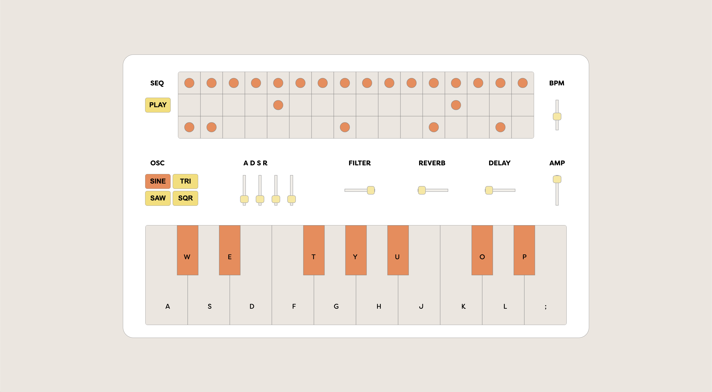

# Soft Sound v2.0: Browser Synthesizer and Drum Sequencer

[Soft Sound](https://alextownson.github.io/soft-sound/) is a browser synthesizer and drum sequencer that I created using HTML, CSS, and P5.js. This is one of the first projects I've created that combines my passion for music, design and web development. 

## Code

This project began by following a series of tutorials to create the drum sequencer. This is also where I got the drum samples I used in the project. 

By using P5.js Instance Mode, I was able to create multiple sketches. In v1.0 of Soft Sound, that included the drum sequencer, an oscillator touch pad, and a noise generator. The oscillator and noise were created using the [P5.sound reference](https://p5js.org/reference/#/libraries/p5.sound). 

In v2.0 of Soft Sound, I wanted to create something original, without following a tutorial or documentation example. I have gotten rid of the oscillator touch pad and noise generator. I added a keyboard with touch/key input and sliders for ADSR, a low pass filter, reverb, delay, volume and tempo. 

## Mobile Issue 

As of right now, the synth is not able to play sounds properly on mobile. This may be due to the way I have written the keyboard functionality. I am attempting a rewrite using a p5 sound poly synth to see if this fixes the issue. 

## Design 

The inspiration for the design of the synth came from vintage record players and new vintage motorcycles. 

I wanted to create a retro-esque design because I learned about vintage analog synthesizers to create the controls. I chose the font [Filson Soft](https://fonts.adobe.com/fonts/filson) because I wanted something rounded to match the rounded look of the synth.
