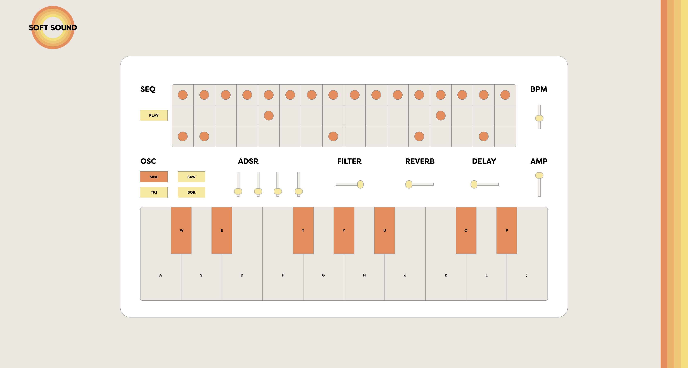
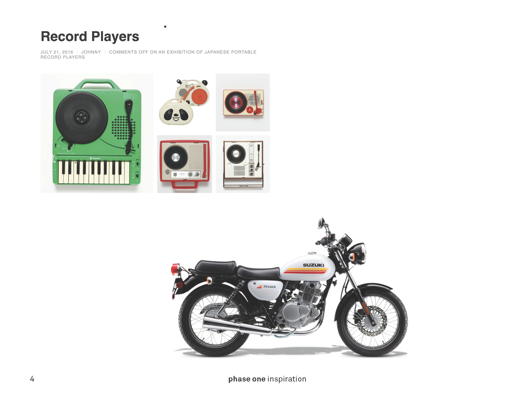
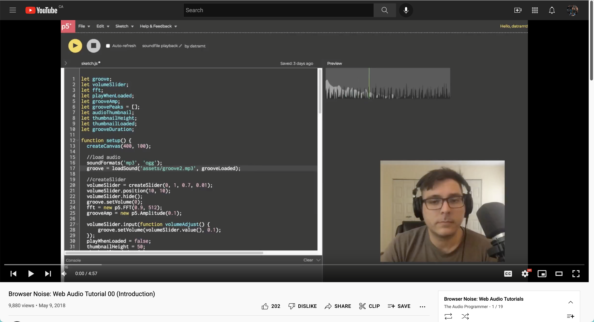
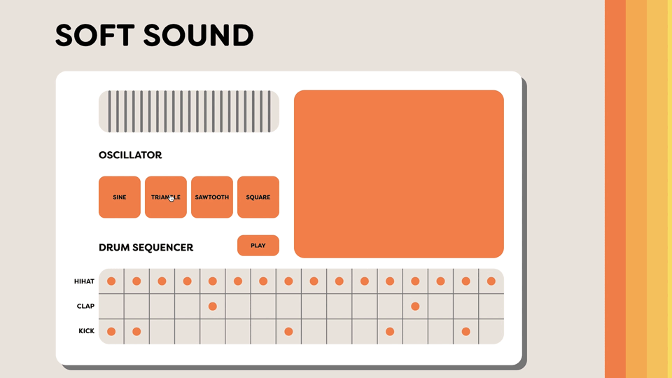
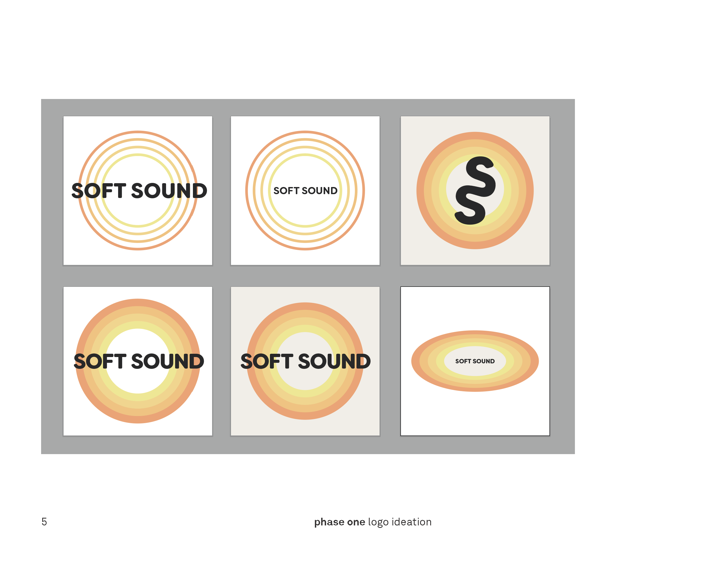
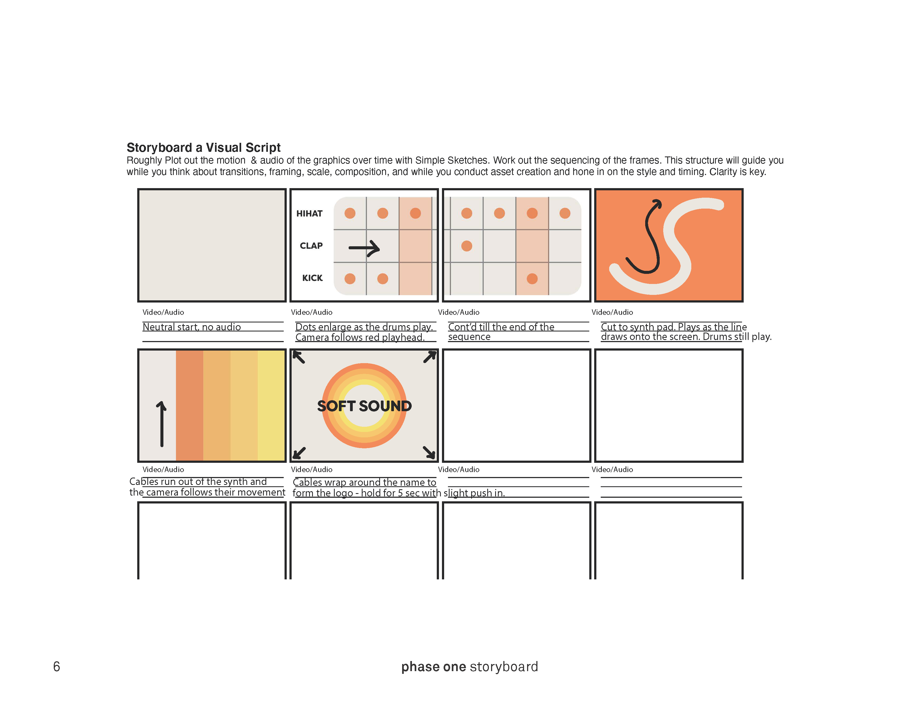
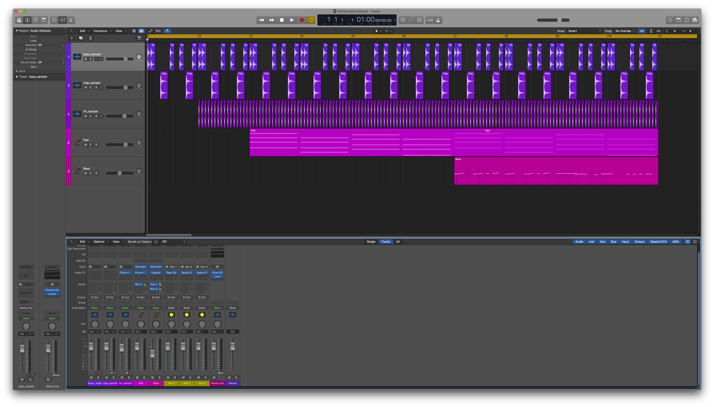
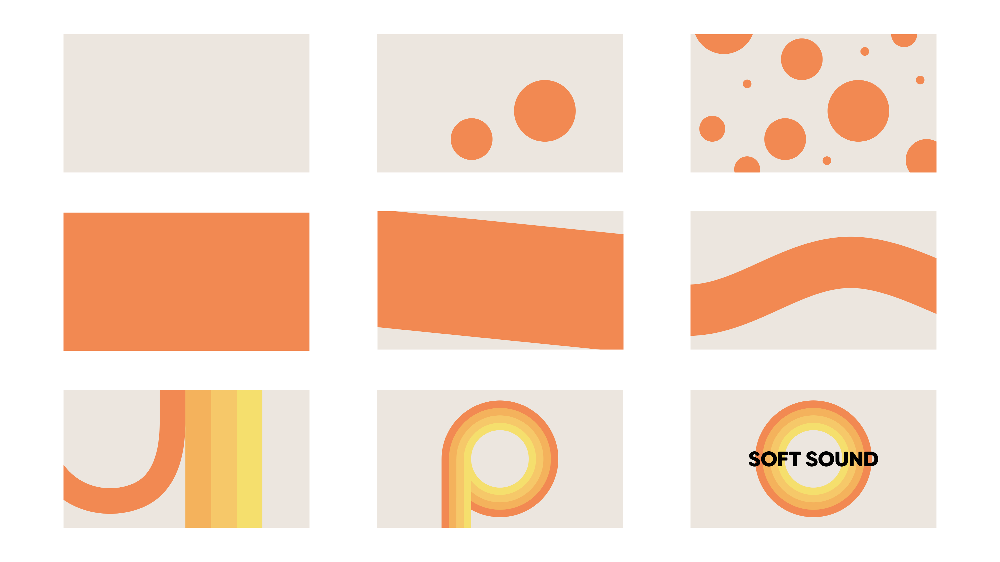

# Soft Sound v2.0: Browser Synthesizer and Drum Sequencer

[Soft Sound](https://alextownson.github.io/soft-sound/) is a browser synthesizer and drum sequencer that I created using HTML, CSS, and P5.js. This is one of the first projects I've created that combines my passion for music, design and web development. 

## Design 

The inspiration for the design of the synth came from vintage record players and new vintage motorcycles. 

[Japanese Portable Record Players](https://www.spoon-tamago.com/2016/07/21/an-exhibition-of-japanese-portable-record-players/)

[Suzuki TU250X Motorcycle](https://mtrracing.net/Motorcycles-Suzuki-TU250X-2019-Woonsocket-RI-b2c6b4e1-ecee-4cae-b442-a96e00844516)

I wanted to create a retro-esque design because I learned about vintage analog synthesizers to create the controls. I chose the font [Filson Soft](https://fonts.adobe.com/fonts/filson) because I wanted something rounded to match the rounded look of the synth.

## Code

This project began by following a series of tutorials to create the drum sequencer. This is also where I got the drum samples I used in the project. 

By using P5.js Instance Mode, I was able to create multiple sketches. In v1.0 of Soft Sound, that included the drum sequencer, an oscillator touch pad, and a noise generator. The oscillator and noise were created using the [P5.sound reference](https://p5js.org/reference/#/libraries/p5.sound). 

In v2.0 of Soft Sound, I have gotten rid of the oscillator touch pad and noise generator. I added a keyboard with touch/key input and sliders for ADSR, a low pass filter, reverb, delay, volume and tempo.  

## Advertisement

After releasing v1.0 of Soft Sound, I decided to make a short motion design project to advertise the website. 

1. First I came up with the logo: 

2. Then I came up with the rough storyboard:

3. I recorded the audio and created polished graphics.

4. Lastly, I animated everything to the soundtrack.

## v2.1

1. v2.0 of Soft Sound works on various desktop screen sizes however a huge oversight of mine was that it does not scale correctly for tablet/mobile. In my next release, I intend to correct the layout so that it can be used on mobile, tablet, and desktop.   
